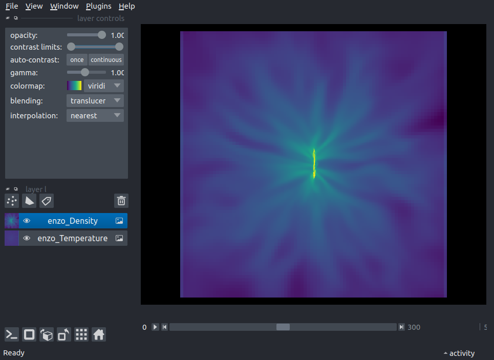
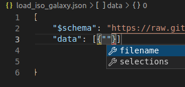

# yt-napari

[](https://github.com/data-exp-lab/yt-napari/raw/main/LICENSE)
[](https://pypi.org/project/yt-napari)
[](https://python.org)
[](https://github.com/data-exp-lab/yt-napari/actions)
[](https://codecov.io/gh/data-exp-lab/yt-napari)
[](https://napari-hub.org/plugins/yt-napari)
[](https://yt-napari.readthedocs.io/en/latest/?badge=latest)

A [napari] plugin for loading data from [yt].

This readme provides a brief overview including:

1. [Installation](#Installation)
2. [Quick Start](#Quick-Start)

Full documentation is available at [yt-napari.readthedocs.io].

## Installation

### 1. (optional) install `yt` and `napari`

If you skip this step, the installation in the following section will only install the minimal package requirements for `yt` or `napari`, in which case you will likely need to manually install some packages. So if you are new to either package, or if you are installing in a clean environment, it may be simpler to  install these packages first.

For `napari`,

    pip install napari[all]

will install `napari` with the default `Qt` backend (see [here](https://napari.org/tutorials/fundamentals/installation#choosing-a-different-qt-backend) for how to choose between `PyQt5` or `PySide2`).

For `yt`, you will need `yt>=4.0.1` and any of the optional dependencies for your particular workflow. If you know that you'll need more than the base `yt` install, you can install the full suite of dependent packages with

    pip install yt[full]

See the [`yt` documentation](https://yt-project.org/doc/installing.html#leveraging-optional-yt-runtime-dependencies) for more information. If you're not sure which packages you'll need but don't want the full yt installation, you can proceed to the next step and then install any packages as needed (you will receive error messages when a required package is missing).

### 2. install `yt-napari`

You can install the `yt-napari` plugin with:

    pip install yt-napari

If you are missing either `yt` or `napari` (or they need to be updated), the above installation will fetch and run a minimal installation for both.

To install the latest development version of the plugin instead, use:

    pip install git+https://github.com/data-exp-lab/yt-napari.git

## Quick Start

After [installation](#Installation), there are three modes of using `yt-napari`:

1. jupyter notebook interaction ([jump down](#jupyter-notebook-interaction))
2. loading a json file from the napari gui ([jump down](#loading-a-json-file-from-the-napari-gui))
3. napari widget plugins (in progress) ([jump down](#napari-widget-plugins))

### jupyter notebook interaction

`yt-napari` provides a helper class, `yt_napari.viewer.Scene` that assists in properly aligning new yt selections in the napari viewer when working in a Jupyter notebook.

```python
import napari
import yt
from yt_napari.viewer import Scene
from napari.utils import nbscreenshot

viewer = napari.Viewer()
ds = yt.load("IsolatedGalaxy/galaxy0030/galaxy0030")
yt_scene = Scene()

left_edge = ds.domain_center - ds.arr([40, 40, 40], 'kpc')
right_edge = ds.domain_center + ds.arr([40, 40, 40], 'kpc')
res = (600, 600, 600)

yt_scene.add_to_viewer(viewer,
                       ds,
                       ("enzo", "Temperature"),
                       left_edge = left_edge,
                       right_edge = right_edge,
                       resolution = res)

yt_scene.add_to_viewer(viewer,
                       ds,
                       ("enzo", "Density"),
                       left_edge = left_edge,
                       right_edge = right_edge,
                       resolution = res)

nbscreenshot(viewer)
```

 

`yt_scene.add_to_viewer` accepts any of the keyword arguments allowed by `viewer.add_image`. See the full documentation (!!!NEED LINK!!!) for more examples, including additional helper methods for linking layer appearance.

### loading a json file from the napari gui

`yt-napari` also provides the ability to load json directive files from the napari GUI as you would load any image file (`File->Open`). The json file describes the selection process for a dataset as described by a json-schema. The following json file results in similar layers as the above notebook example

```json
{"$schema": "https://raw.githubusercontent.com/data-exp-lab/yt-napari/main/src/yt_napari/schemas/yt-napari_0.0.1.json",
 "data": [{"filename": "IsolatedGalaxy/galaxy0030/galaxy0030",
           "selections": [{
                            "fields": [{"field_name": "Temperature", "field_type": "enzo", "take_log": true},
                                       {"field_name": "Density", "field_type": "enzo", "take_log": true}],
                            "left_edge": [460.0, 460.0, 460.0],
                            "right_edge": [560.0, 560.0, 560.0],
                            "resolution": [600, 600, 600]
                          }],
           "edge_units": "kpc"
         }]
}
```

Note that when live-editing the json in a development environment like vscode, you will get hints and autocomplete:



See the full documentation at [yt-napari.readthedocs.io] for a complete specification.

### napari widget plugins

A napari dockable widget is in progress that will allow you to load data from within the napari GUI without a json file.

## Contributing

Contributions are very welcome! Development follows a fork and pull request workflow. To get started, you'll need a development installation and a testing environment.

### development environment

To start developing, fork the repository and clone your fork to get a local copy. You can then install in development mode with

    pip install -e .

### tests and style checks

Both bug fixes and new features will need to pass the existing test suite and style checks. While both will be run automatically when you submit a pull request, it is helpful to run the test suites locally and run style checks throughout development. For testing, you can use [tox].

    pip install tox

And then from the top level of the `yt-napari` directory, run

    tox .

Tox will then run a series of tests in isolated environments. In addition to checking the terminal output for test results, the tox run will generate a test coverage report: a `coverage.xml` file and a `htmlcov` folder -- to view the results, open `htmlcov/index.html` in a browser.

For style checks, you can use [pre-commit](https://pre-commit.com/) to run checks as you develop. To set up `pre-commit`:

    pip install pre-commit
    pre-commit install

after which, every time you run `git commit`, some automatic style adjustments and checks will run. The same style checks will run when you submit a pull request, but it's often easier to catch them early.

### building documentation locally

Documentation can be built using `sphinx` in two steps. First, update the api mapping with

```
sphinx-apidoc -f -o docs/source src/yt_napari/
```

This will update the `rst` files in `docs/source/` with the latest docstrings in `yt_napari`. Next, build the html documentation with

```
make html
```

### updating the pydantic models and schema

Updates to the pydantic models should be accompanied by updates to the json schema. There are a number of utilities to help automate the management of schema.

The schema versioning falls a standard `major.minor.patch` versioning pattern and yt-napari schema are stored in `src/yt_napari/schemas/`. When changing the model, you can store a new schema with:

```
from yt_napari._data_model import _store_schema
_store_schema()
```

After updating or adding new schema, the docs also need to be updated. To do that, run `blah` and it will copy over schema files to the `docs/_static` folder, update which file is the latest, and update the table of available schema in `docs/schema.rst`.

The default behavior is to increment the minor version of the schema. To


## License

Distributed under the terms of the [BSD-3] license,
"yt-napari" is free and open source software

## Issues

If you encounter any problems, please [file an issue] along with a detailed description.

----------------------------------

This [napari] plugin was generated with [Cookiecutter] using [@napari]'s [cookiecutter-napari-plugin] template.

<!--
Don't miss the full getting started guide to set up your new package:
https://github.com/napari/cookiecutter-napari-plugin#getting-started

and review the napari docs for plugin developers:
https://napari.org/plugins/stable/index.html
-->

[napari]: https://github.com/napari/napari
[Cookiecutter]: https://github.com/audreyr/cookiecutter
[@napari]: https://github.com/napari
[MIT]: http://opensource.org/licenses/MIT
[BSD-3]: http://opensource.org/licenses/BSD-3-Clause
[GNU GPL v3.0]: http://www.gnu.org/licenses/gpl-3.0.txt
[GNU LGPL v3.0]: http://www.gnu.org/licenses/lgpl-3.0.txt
[Apache Software License 2.0]: http://www.apache.org/licenses/LICENSE-2.0
[Mozilla Public License 2.0]: https://www.mozilla.org/media/MPL/2.0/index.txt
[cookiecutter-napari-plugin]: https://github.com/napari/cookiecutter-napari-plugin
[yt-napari.readthedocs.io]: https://yt-napari.readthedocs.io/

[file an issue]: https://github.com/data-exp-lab/yt-napari/issues

[napari]: https://github.com/napari/napari
[tox]: https://tox.readthedocs.io/en/latest/
[pip]: https://pypi.org/project/pip/
[PyPI]: https://pypi.org/
[yt]: https://yt-project.org/
