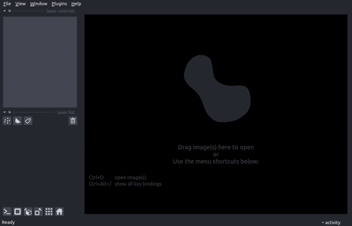

Quick Start
===========

After installation, there are three modes of using :code:`yt-napari`:

1. :ref:`jupyter notebook interaction<jupyusage>`
2. :ref:`loading a json file from the napari gui<jsonload>`
3. :ref:`napari gui plugins<naparigui>`

.. _jupyusage:

jupyter notebook interaction
****************************

:code:`yt-napari` provides a helper class, :code:`yt_napari.viewer.Scene` that assists in properly aligning new yt selections in the napari viewer when working in a Jupyter notebook.

.. code-block:: python

    import napari
    import yt
    from yt_napari.viewer import Scene
    from napari.utils import nbscreenshot

    viewer = napari.Viewer()
    ds = yt.load("IsolatedGalaxy/galaxy0030/galaxy0030")
    yt_scene = Scene()

    left_edge = ds.domain_center - ds.arr([40, 40, 40], 'kpc')
    right_edge = ds.domain_center + ds.arr([40, 40, 40], 'kpc')
    res = (600, 600, 600)

    yt_scene.add_to_viewer(viewer,
                           ds,
                           ("enzo", "Temperature"),
                           left_edge = left_edge,
                           right_edge = right_edge,
                           resolution = res)

    yt_scene.add_to_viewer(viewer,
                           ds,
                           ("enzo", "Density"),
                           left_edge = left_edge,
                           right_edge = right_edge,
                           resolution = res)

:code:`yt_scene.add_to_viewer` accepts any of the keyword arguments allowed by :code:`viewer.add_image`.

See :meth:`yt_napari.viewer.Scene` for all available methods and the :doc:`example notebooks <notebooks>` for further examples.

.. _jsonload:

loading a json file from the napari gui
***************************************

:code:`yt-napari` also provides the ability to load json directive files from the napari GUI as you would load any image file (:code:`File->Open`). The json file describes the selection process for a dataset as described by a json-schema. The following json file results in similar layers as the above notebook example

.. code-block:: json

    {"$schema": "https://raw.githubusercontent.com/data-exp-lab/yt-napari/main/src/yt_napari/schemas/yt-napari_0.0.1.json",
     "data": [{"filename": "IsolatedGalaxy/galaxy0030/galaxy0030",
               "selections": [{
                                "fields": [{"field_name": "Temperature", "field_type": "enzo", "take_log": true},
                                           {"field_name": "Density", "field_type": "enzo", "take_log": true}],
                                "left_edge": [460.0, 460.0, 460.0],
                                "right_edge": [560.0, 560.0, 560.0],
                                "resolution": [600, 600, 600]
                              }],
               "edge_units": "kpc"
             }]
    }

Note that when live-editing the json in a development environment like vscode, you will get hints and autocomplete.

.. _naparigui:

napari widget plugins
*********************

In addition to the reader-plugin mentioned above, yt-napari includes a napari dock widget for loading in data selections from yt. If you have ideas for additional plugins, definitely reach out!

The yt-napari yt Reader:
########################

The use the yt Reader plugin, from a Napari viewer, select "Plugins -> yt-napari: yt Reader". Enter or select a file to load, fill out the remaining items to select a field and extent of the spatial selection, then hit load. yt-napari will then load the dataset, sample it and return a new napari image layer.

The reader plugin does its best to align new selections of data with existing yt-napari image layers and should be able to properly align selections from different yt datasets (please submit a bug report if it fails!).
